# Fitness Code

A mobile application built with **React Native** and **Expo**. It helps users plan workouts, create fitness profiles, and track their progress.

## Features

🔐 User Authentication

- Login and multi-step registration flow

✅ Form Validation

- Input validation using Zod

🔔 Toast Notifications

- Real-time feedback for successful or failed authentication actions

🧭 Onboarding Flow

- Guided introduction to the app's main features

🧑‍💪 Fitness Profile Setup

- Multi-step form to personalize the user fitness profile

## Tech Stack

- React Native
- Expo
- JavaScript / TypeScript
- Tamagui Component Library
- Zod
- REST API

---

## Getting Started

### 1. Clone the repository

```bash
git clone git@github.com:ntalys/fitness-code-mobile-fe.git
cd fitness-code-mobile-fe
```

### 2. Install Dependencies

```
npm install
```

### 3. Start Metro server

```
npm start
```

### 4. Open Android/IOS simulator

#### Android

```
press a
```

#### IOS

```
press i
```

## Screenshots

### Onboarding

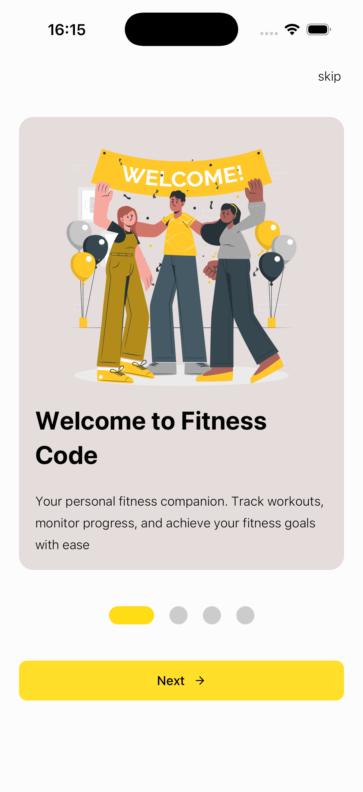
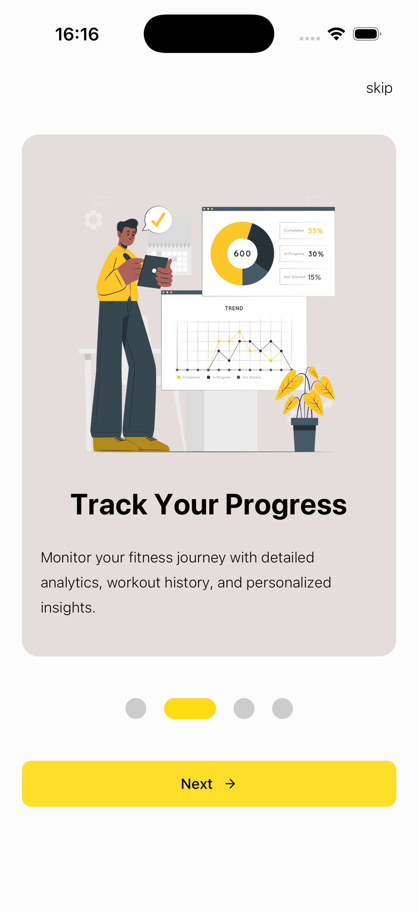
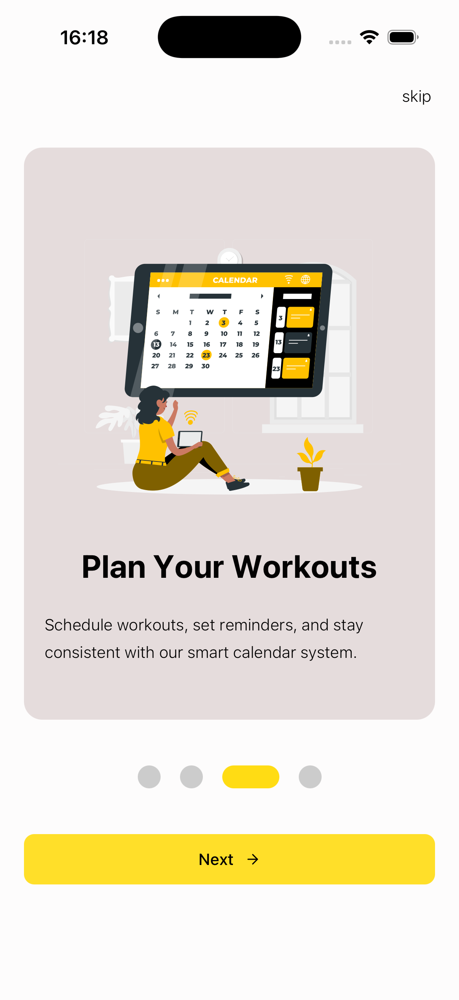
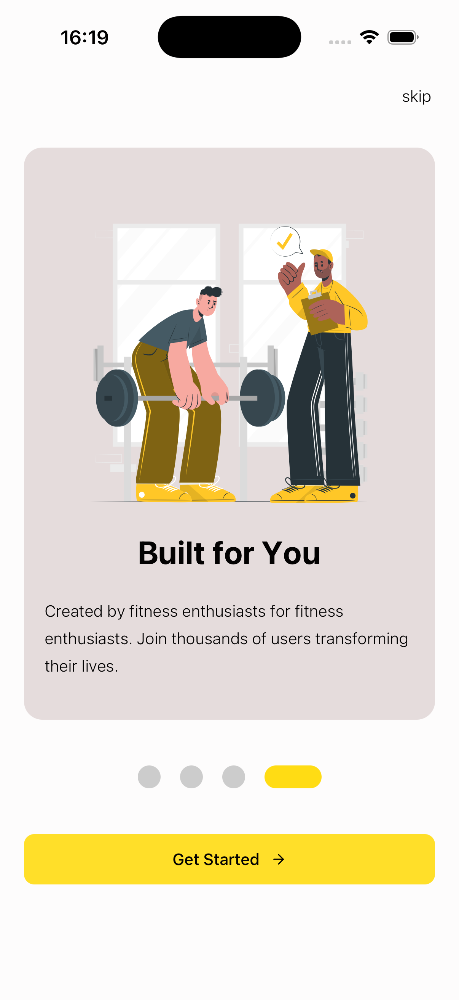

### Login

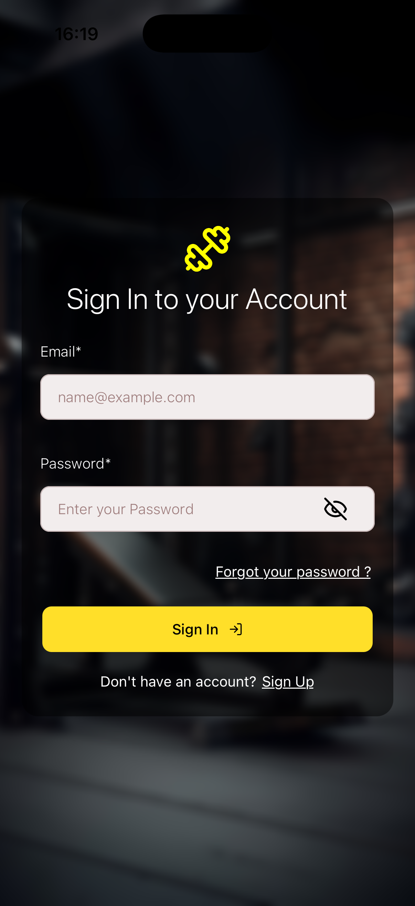

### Forgot Password

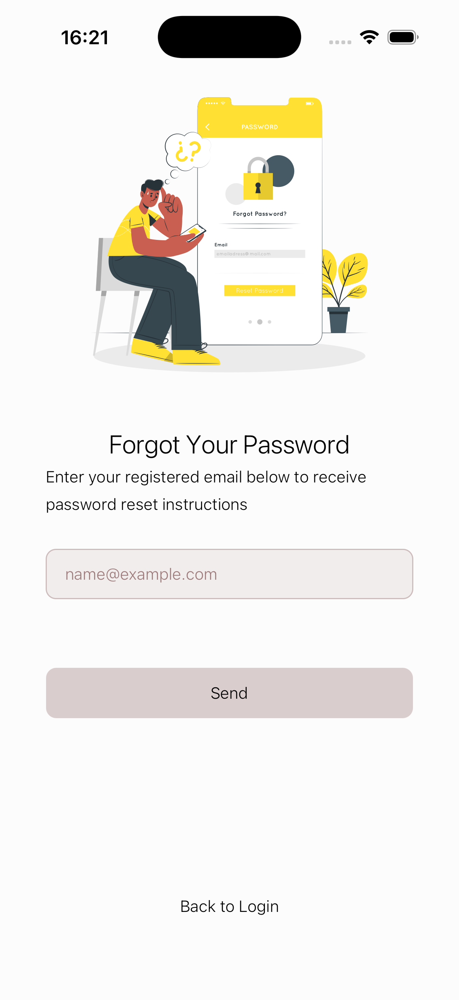

### Register

#### Step 1

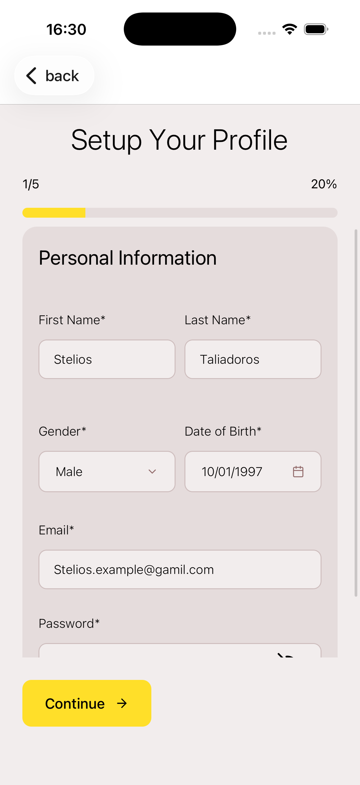

#### Step 2

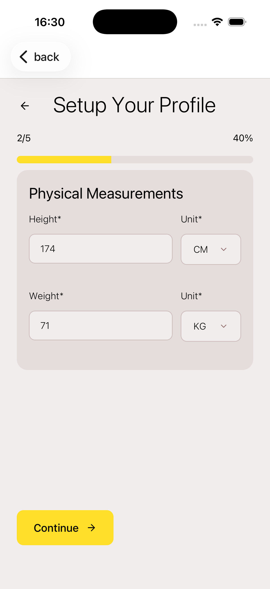

#### Step 3

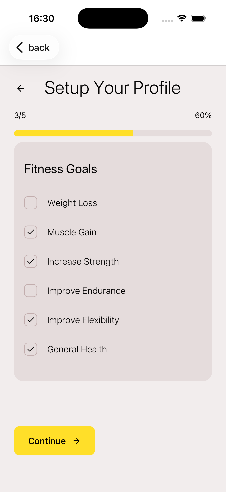

#### Step 4

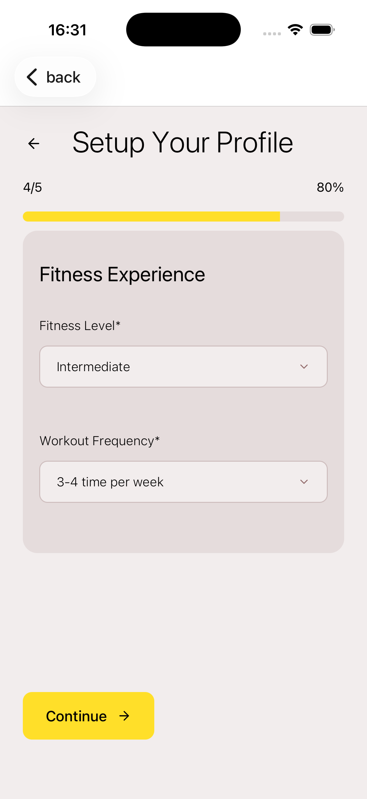

#### Step 5 A

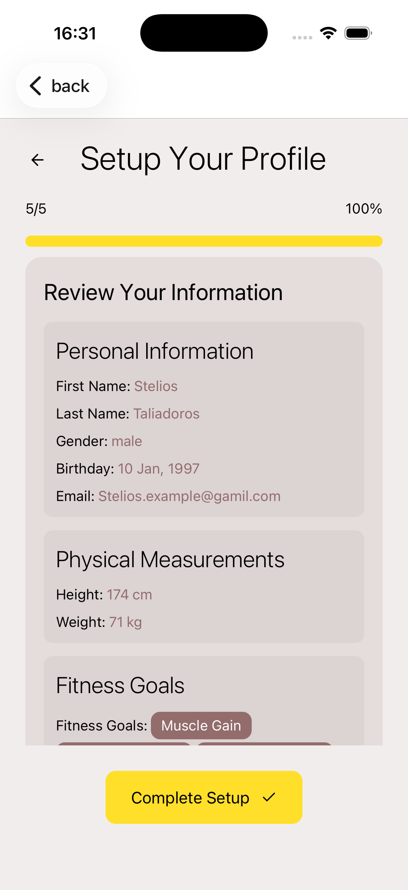

#### Step 5 B

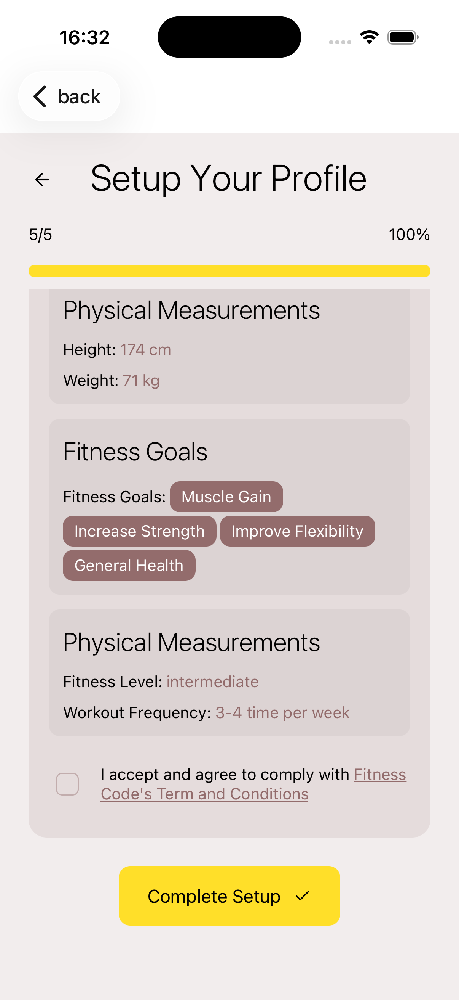

### Toaster

#### Success Toaster

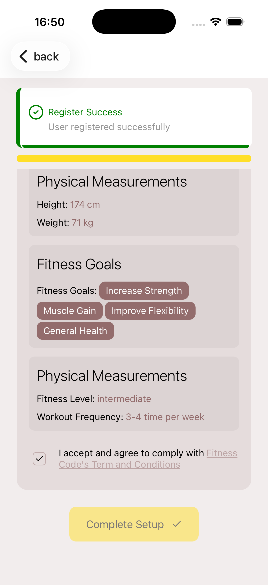

#### Invalid Toaster

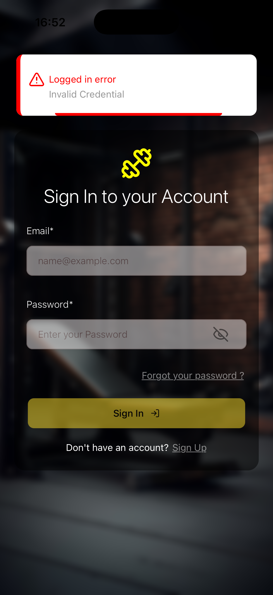

### Profile

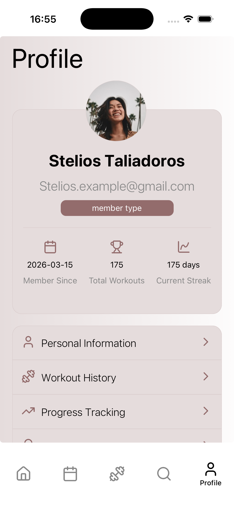
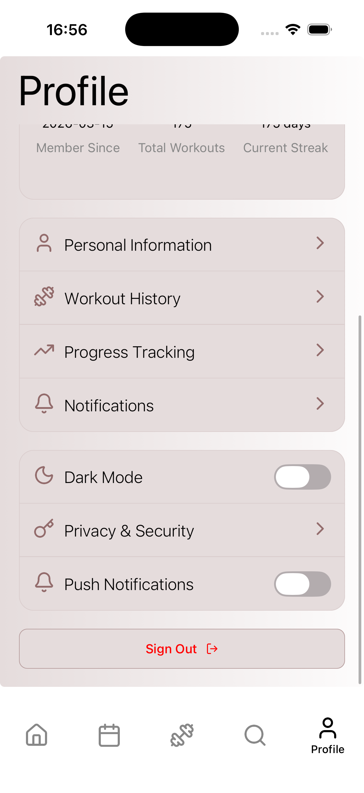

## Future Improvements

### Planned features and improvements:

- 🌙 Implement dark / light theme

- 🏠 Implement Home Page

- 📅 Implement Workout Calendar

- 🏋️ Implement Workout Page

- 🔎 Implement Exercise Search

- 👤 Improve Profile Page

- 📊 Add progress tracking and analytics

## Author

Developed as a React Native portfolio project to demonstrate mobile development skills using modern tools and best practices.
